# grokinstall-website

<p align="center">
  <picture>
    <source media="(prefers-reduced-motion: reduce)" srcset="assets/hero/hero-reduced.svg">
    <source media="(prefers-color-scheme: light)" srcset="assets/hero/hero-light.svg">
    
  </picture>
</p>

<p align="center">
  <picture>
    <source media="(prefers-reduced-motion: reduce)" srcset="assets/hero/computational-dark.svg">
    <source media="(prefers-color-scheme: light)" srcset="assets/hero/computational-light.svg">
    
  </picture>
</p>

The public site for [GrokInstall](https://github.com/M4G3LL4N0/grokinstall).

A static Vite + TypeScript site. No runtime framework, no analytics, no
tracking, no cookies.

## Commands

```bash
pnpm install
pnpm dev        # local development
pnpm lint       # eslint, zero warnings tolerated
pnpm typecheck  # tsc --noEmit
pnpm build      # typecheck, then production build to dist/
pnpm preview    # serve the production build
```

## Principles this site follows

- **No invented claims.** Every figure on the page was measured by running the
  published binary. Where a number is an observation rather than a promise, the
  page says so.
- **Supported and planned are never blurred.** The page describes what runs
  today and marks anything else as not-yet.
- **No `curl | sh`.** The install section leads with a download and a checksum
  verification step, because asking people to pipe a script into a shell is
  asking them to trust an unverified string.
- **Bounded dependencies.** Vite and TypeScript. Nothing ships that is not used.

## Verified content

The contract shown on the page is byte-for-byte the output of
`grokinstall grokbot bat.review` from the published v0.1.1 darwin/arm64
binary. The refusal shown is the real output of an attempted `click` install.
Regenerate both with `pnpm dev` after changing the binary version.

## Deploying

Vercel detects Vite automatically. No configuration is required.

<!-- TRILLIONX:presentation:begin -->

### Animated surfaces

Generated from this repository's own source tree: every count, route and module below was measured, not written by hand.

#### Identity

<picture>
  <source media="(prefers-reduced-motion: reduce)" srcset="https://raw.githubusercontent.com/M4G3LL4N0/grokinstall-website/main/.github-art/surfaces/hero-reduced.svg">
  <source media="(prefers-color-scheme: light)" srcset="https://raw.githubusercontent.com/M4G3LL4N0/grokinstall-website/main/.github-art/surfaces/hero-light.svg">
  
</picture>

#### Entry points

<picture>
  <source media="(prefers-reduced-motion: reduce)" srcset="https://raw.githubusercontent.com/M4G3LL4N0/grokinstall-website/main/.github-art/surfaces/terminal-reduced.svg">
  <source media="(prefers-color-scheme: light)" srcset="https://raw.githubusercontent.com/M4G3LL4N0/grokinstall-website/main/.github-art/surfaces/terminal-light.svg">
  
</picture>

#### Modules

<picture>
  <source media="(prefers-reduced-motion: reduce)" srcset="https://raw.githubusercontent.com/M4G3LL4N0/grokinstall-website/main/.github-art/surfaces/architecture-reduced.svg">
  <source media="(prefers-color-scheme: light)" srcset="https://raw.githubusercontent.com/M4G3LL4N0/grokinstall-website/main/.github-art/surfaces/architecture-light.svg">
  
</picture>

#### Primitives

<picture>
  <source media="(prefers-reduced-motion: reduce)" srcset="https://raw.githubusercontent.com/M4G3LL4N0/grokinstall-website/main/.github-art/surfaces/state_machine-reduced.svg">
  <source media="(prefers-color-scheme: light)" srcset="https://raw.githubusercontent.com/M4G3LL4N0/grokinstall-website/main/.github-art/surfaces/state_machine-light.svg">
  
</picture>

#### Build and tests

<picture>
  <source media="(prefers-reduced-motion: reduce)" srcset="https://raw.githubusercontent.com/M4G3LL4N0/grokinstall-website/main/.github-art/surfaces/build-reduced.svg">
  <source media="(prefers-color-scheme: light)" srcset="https://raw.githubusercontent.com/M4G3LL4N0/grokinstall-website/main/.github-art/surfaces/build-light.svg">
  
</picture>

#### Workflow

<picture>
  <source media="(prefers-reduced-motion: reduce)" srcset="https://raw.githubusercontent.com/M4G3LL4N0/grokinstall-website/main/.github-art/surfaces/workflow-reduced.svg">
  <source media="(prefers-color-scheme: light)" srcset="https://raw.githubusercontent.com/M4G3LL4N0/grokinstall-website/main/.github-art/surfaces/workflow-light.svg">
  
</picture>

#### Domain

<picture>
  <source media="(prefers-reduced-motion: reduce)" srcset="https://raw.githubusercontent.com/M4G3LL4N0/grokinstall-website/main/.github-art/surfaces/domain-reduced.svg">
  <source media="(prefers-color-scheme: light)" srcset="https://raw.githubusercontent.com/M4G3LL4N0/grokinstall-website/main/.github-art/surfaces/domain-light.svg">
  
</picture>

#### Identity object

<picture>
  <source media="(prefers-reduced-motion: reduce)" srcset="https://raw.githubusercontent.com/M4G3LL4N0/grokinstall-website/main/.github-art/surfaces/footer-reduced.svg">
  <source media="(prefers-color-scheme: light)" srcset="https://raw.githubusercontent.com/M4G3LL4N0/grokinstall-website/main/.github-art/surfaces/footer-light.svg">
  
</picture>

<!-- TRILLIONX:presentation:end -->

<!-- TRILLIONX:evidence:begin -->

## What is measurable here

Generated by `.github-art` from the source tree at publish time.

| Signal | Value |
| --- | --- |
| HTTP routes | 0 |
| Entry points | 1 |
| Module roots | 1 |
| Test files | 0 |
| CI workflows | 0 |
| Distinctive stack | scaffold only |
| Status | PROTOTYPE |
| Evidence confidence | E3 |
| Animated surfaces | 8 |

<!-- TRILLIONX:evidence:end -->
